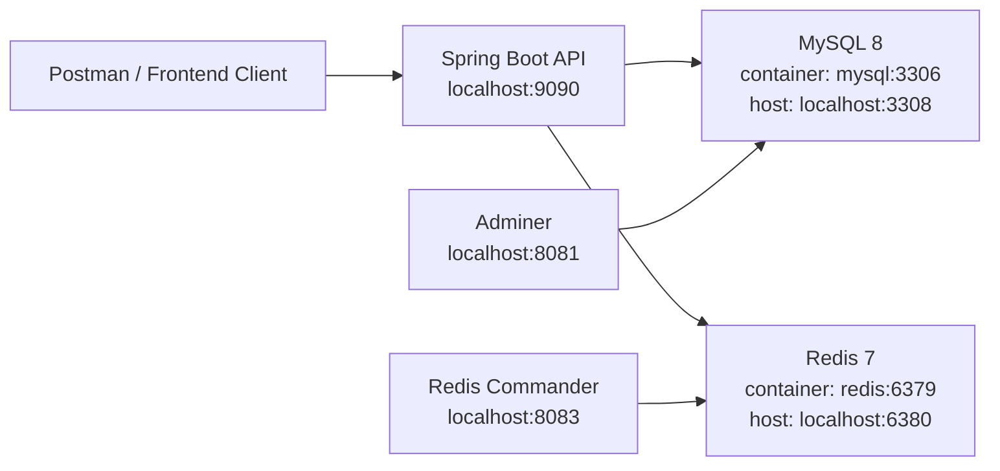

# Role & Permission Manager

Role & Permission Manager is a Spring Boot backend for managing users, roles, authentication, and protected user CRUD operations. It uses MySQL for persistence, Redis for caching, JWT for stateless API security, and Docker Compose for local integration testing.

The seed data creates 30 users on first startup, including an admin account:

```text
Email: admin@example.com
Password: admin123
Role: ADMIN
```

## Architecture



## Prerequisites

- Java 17
- Maven
- Docker Desktop
- Postman or another API client
- Git

MySQL and Redis do not need separate local installation for the Docker setup. Docker Compose starts them automatically as containers.

## Setup Steps

1. Open the project folder:

```powershell
cd C:\Users\mahad\Downloads\role-permission-manager
```

2. Build the backend jar:

```powershell
cd backend
mvn package -DskipTests
cd ..
```

3. Start the full Docker stack:

```powershell
docker compose up --build -d
```

4. Check that services are running:

```powershell
docker compose ps
```

Expected services:

```text
rpm_api        localhost:9090
rpm_mysql      localhost:3308
rpm_redis      localhost:6380
rpm_adminer    localhost:8081
rpm_redis_ui   localhost:8083
```

5. Login with Postman:

```text
POST http://localhost:9090/auth/login
```

Body:

```json
{
  "email": "admin@example.com",
  "password": "admin123"
}
```

Use the returned JWT as a Bearer Token for protected `/users` endpoints.

## API Smoke Tests

Get all users:

```text
GET http://localhost:9090/users/all?page=0&size=30
```

Create user:

```text
POST http://localhost:9090/users/create
```

```json
{
  "name": "Postman User",
  "email": "postmanuser@example.com",
  "password": "pass123",
  "role": "USER",
  "isActive": true
}
```

Update user:

```text
PUT http://localhost:9090/users/{id}
```

Delete user:

```text
DELETE http://localhost:9090/users/{id}
```

## Useful URLs

| Tool | URL | Notes |
| --- | --- | --- |
| Backend API | `http://localhost:9090` | Spring Boot application |
| Adminer | `http://localhost:8081` | MySQL browser UI |
| Redis Commander | `http://localhost:8083` | Redis browser UI |

Adminer connection:

| Field | Value |
| --- | --- |
| System | `MySQL` |
| Server | `mysql` |
| Username | `root` |
| Password | `Preeti@20042004` |
| Database | `mydb` |

## Environment Reference

| Variable | Default / Docker Value | Purpose |
| --- | --- | --- |
| `SERVER_PORT` | `8080` in Docker, `9090` locally | Spring Boot server port |
| `SPRING_DATASOURCE_URL` | `jdbc:mysql://mysql:3306/mydb?allowPublicKeyRetrieval=true&useSSL=false` | MySQL JDBC URL |
| `SPRING_DATASOURCE_USERNAME` | `root` | MySQL username |
| `SPRING_DATASOURCE_PASSWORD` | `Preeti@20042004` | MySQL password |
| `SPRING_DATA_REDIS_HOST` | `redis` | Redis host used by Spring |
| `SPRING_DATA_REDIS_PORT` | `6379` | Redis port used by Spring |
| `MAIL_HOST` | `smtp.gmail.com` | SMTP host |
| `MAIL_PORT` | `587` | SMTP port |
| `MAIL_USERNAME` | empty by default | SMTP username |
| `MAIL_PASSWORD` | empty by default | SMTP password |
| `JWT_SECRET` | `mysecretkeymysecretkeymysecretkey` | Secret used to sign JWT tokens |
| `JWT_EXPIRATION_SECONDS` | `3600` | JWT lifetime in seconds |
| `app.scheduling.enabled` | disabled by default | Enables scheduled email jobs when set to `true` |

## Run Tests

From the backend folder:

```powershell
cd backend
mvn test
```

Run coverage verification:

```powershell
mvn verify
```

## Stop Services

Stop containers while keeping data:

```powershell
docker compose down
```

Stop containers and delete database/cache volumes:

```powershell
docker compose down -v
```
